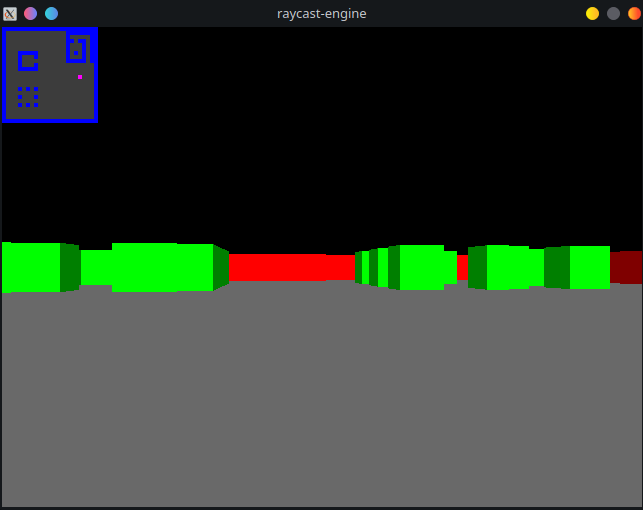

# raycast-engine
Software renderer that functions in a similar way as the renderer used in Wolfenstein 3D.

## How to use
- Move the camera using A and D
- Move forward and backward using W and S

## Screenshots
