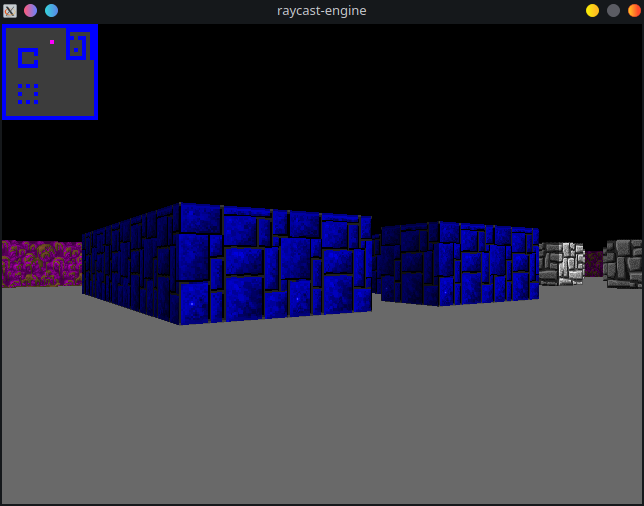

# raycastenstein-3d

Software renderer that functions in a similar way as the renderer used in Wolfenstein 3D from 1992.
Compatible with both Linux and Windows.

## How to play

- Move the camera using `A` and `D`
- Move forward and backward using `W` and `S`

## Screenshots




## Compilation

#### Linux

To compile the project, simply use the provided `CMakeLists.txt` by typing the following commands:
```
mkdir build
cd build
cmake .. && make
./raycast-engine
```

#### Windows

Provided that you've installed the `SDL2` and `SDL2_image` libraries properly, you can build the executable by using this commands:
```
mkdir build
cd build
cmake .. -G "MinGW Makefiles"; make -j8
./raycast-engine
```

### Texture-less version
To compile the version of this project that does not use textures, simply define the flag `-DNO_TEXTURES=1` when generating the Makefile using CMake.


## How it works

The rendering side of this program is rather simple.
You simply draw the world column by column (where each column is a vertical line on the framebuffer).
Each column of the framebuffer corresponds to a ray that goes from the camera to the object. When an object has been hit (i.e. a wall), the corresponding column is rendered using the color of the object.

The size of the column depends on the distance between the player and the object, rather than the distance traveled by the ray from the center of the camera, otherwise we would get the so called "fisheye effect".

To detect when a wall has been hit, we make use of an algorithm called **DDA** (Digital Differential Analyzer). This allows the ray to travel very fast on the map, without needing to use a fixed step size that would either miss walls or take too many steps to hit a wall (thus resulting in a performance hit).

A more thorough explanation can be found [here](https://lodev.org/cgtutor/raycasting.html).
